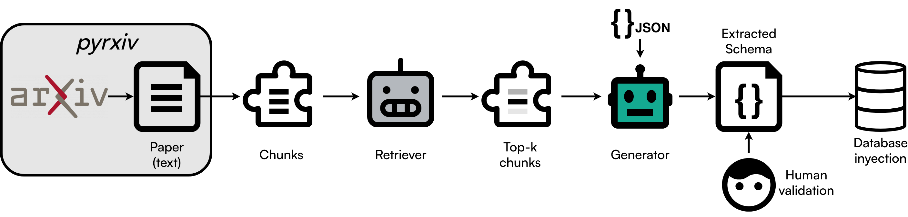

# Using the RAG Extractor Agent

This tutorial will guide you through using NERxiv's RAG (Retrieval-Augmented Generation) extractor agent to extract structured metadata from scientific papers. The RAG agent combines text chunking, semantic retrieval, and LLM-based generation to intelligently extract information from arXiv papers.

The RAG extractor agent is a three-stage pipeline that:

1. **Chunks** the paper text into smaller, manageable pieces
2. **Retrieves** the most relevant chunks based on a query
3. **Generates** structured JSON answers using an LLM model

<div class="click-zoom">
    <label>
        <input type="checkbox">
        
    </label>
</div>

!!! note "Prerequisites"
    - **Python ≥ 3.10** installed
    - A virtual environment with `nerxiv` installed
    - Downloaded and set up [Ollama](https://ollama.com/download) for running LLMs locally
    - At least one LLM model pulled: `ollama pull llama3.1` (or your preferred model)
    - An HDF5 file containing extracted paper text using [`pyrxiv`](https://github.com/JosePizarro3/pyrxiv) (see [Tutorial - Downloading arXiv papers as HDF5 files](pyrxiv_download_hdf5.md))


## Installation and Setup

### Create an empty test directory

We will test the `nerxiv` functionalities in an empty directory. Open your terminal and type:
```bash
mkdir test_nerxiv
cd test_nerxiv/
```

### Create a Virtual Environment

We strongly recommend using a virtual environment to avoid conflicts with other packages.

**Using venv:**
```bash
python3 -m venv .venv
source .venv/bin/activate
```

**Using conda:**
```bash
conda create --name .venv python=3.10  # or any version 3.10 <= python <= 3.12
conda activate .venv
```

### Install the Package

`nerxiv` is part of the PyPI registry and can be installed via pip:
```bash
pip install --upgrade pip
pip install nerxiv
```

!!! tip "Faster Installation"
    For faster installation, you can use [`uv`](https://docs.astral.sh/uv/):
    ```bash
    pip install uv
    uv pip install nerxiv
    ```

### Verify Installation

You can verify that the installation was successful by opening the terminal and typing:
```bash
nerxiv --help
```

If everything was successful, you will see the usage of the CLI:
```sh
Usage: nerxiv [OPTIONS] COMMAND [ARGS]...

  Entry point to run `nerxiv` CLI commands.

Options:
  --help  Show this message and exit.

Commands:
  prompt      Prompts the LLM with the text from the HDF5 file and stores...
  prompt_all  Prompts the LLM with the text from all the HDF5 file and...
```

## Basic Usage

The simplest way to use the RAG extractor is through the CLI `prompt` command:

```bash
nerxiv prompt --file-path /path/to/paper.hdf5
```

This will:

- Use the default `Chunker` to split the text
- Use the default retriever model (`all-MiniLM-L6-v2`)
- Retrieve the top 5 most relevant chunks
- Use the default LLM model (`gpt-oss:20b`)
- Execute the default query (`material_formula`) to extract material formulas

## Understanding the Pipeline

### Step 1: Chunking

The chunker divides the paper text into smaller pieces. NERxiv provides three chunking strategies:

- **`Chunker`**: Fixed-size chunks with overlap (default: 1000 characters, 200 overlap)
- **`SemanticChunker`**: Sentence-level semantic chunking using spaCy
- **`AdvancedSemanticChunker`**: KMeans-based clustering on sentence embeddings

Example with semantic chunking:

```bash
nerxiv prompt --file-path paper.hdf5 --chunker SemanticChunker
```

### Step 2: Retrieval

The retriever uses a sentence transformer model to:

1. Encode the retrieval query and all chunks into embeddings
2. Compute cosine similarity between the query and each chunk
3. Return the top N most relevant chunks

The default retriever model is `all-MiniLM-L6-v2` from SentenceTransformers, but you can specify others:

```bash
nerxiv prompt --file-path paper.hdf5 --retriever-model all-mpnet-base-v2
```

You can also adjust how many chunks to retrieve:

```bash
nerxiv prompt --file-path paper.hdf5 --n-top-chunks 10
```

### Step 3: Generation

The LLM generator takes the retrieved chunks and answers your query using a carefully crafted prompt. The answer is structured according to the query type defined in the `PROMPT_REGISTRY`.

## Using Different Queries

NERxiv comes with predefined queries in the `PROMPT_REGISTRY`. Each query has:

- A **retriever query**: Guides what content to retrieve
- A **prompt template**: Instructs the LLM on how to answer

Available queries include:

- `material_formula`: Extracts chemical formulas and material names
- `only_dmft`: Checks if DMFT methodology is used
- `material_formula_structured`: Returns structured chemical formulation data

Example:

```bash
nerxiv prompt --file-path paper.hdf5 --query only_dmft
```

## Configuring LLM Parameters

You can fine-tune the LLM behavior using `--llm-option` (or `-llmo`) flags. These are passed as `key=value` pairs:

```bash
nerxiv prompt \
  --file-path paper.hdf5 \
  --model llama3.1:70b \
  -llmo temperature=0.2 \
  -llmo top_p=0.9 \
  -llmo num_ctx=8192
```

Common LLM parameters:

- `temperature`: Controls randomness (0.0 = deterministic, 1.0 = creative)
- `top_p`: Nucleus sampling threshold
- `num_ctx`: Context window size
- `format`: Output format (e.g., `json`)

## Complete Example

Here's a complete example extracting material formulas with custom settings:

```bash
nerxiv prompt \
  --file-path /data/papers/2502.12144v1.hdf5 \
  --chunker AdvancedSemanticChunker \
  --retriever-model all-mpnet-base-v2 \
  --n-top-chunks 8 \
  --model llama3.1:70b \
  --query material_formula \
  -llmo temperature=0.1 \
  -llmo num_ctx=16384
```

This command:

1. Uses advanced semantic chunking with KMeans clustering
2. Uses a more powerful retriever model
3. Retrieves the top 8 most relevant chunks
4. Uses the 70B parameter Llama model
5. Sets low temperature for consistent outputs
6. Expands the context window to 16K tokens

## Processing Multiple Papers

To process all papers in a directory, use the `prompt-all` command:

```bash
nerxiv prompt-all \
  --data-path /path/to/papers/ \
  --query material_formula \
  --model llama3.1:70b
```

This will process all `.hdf5` files in the specified directory with the same configuration.

## Output Storage

The RAG extractor stores results directly in the HDF5 file under the `raw_llm_answers` group. Each run is assigned a unique ID and includes:

- Timestamp
- Model configurations (retriever model, LLM model, chunk count)
- Query used
- Retrieved chunks
- Generated answer

You can inspect the results by opening the HDF5 file with any HDF5 viewer or using Python:

```python
import h5py

with h5py.File("paper.hdf5", "r") as f:
    # List all runs
    runs = list(f["raw_llm_answers"].keys())

    # Access the latest run
    latest_run = f["raw_llm_answers"][runs[-1]]

    # Read the answer
    answer = latest_run["material_formula"]["answer"][()].decode("utf-8")
    print(answer)
```

## Next Steps

Now that you understand the RAG extractor basics, explore:

- [How to customize chunking strategies](../howtos/customize-chunking.md)
- [How to create custom prompts](../howtos/create-custom-prompts.md)
- [Understanding RAG](../explanations/what-is-rag.md)
